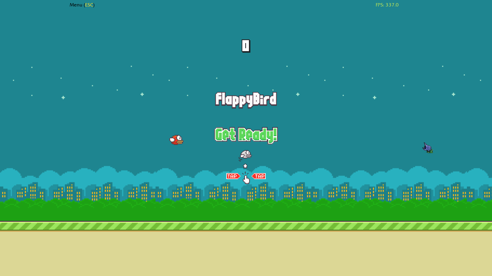
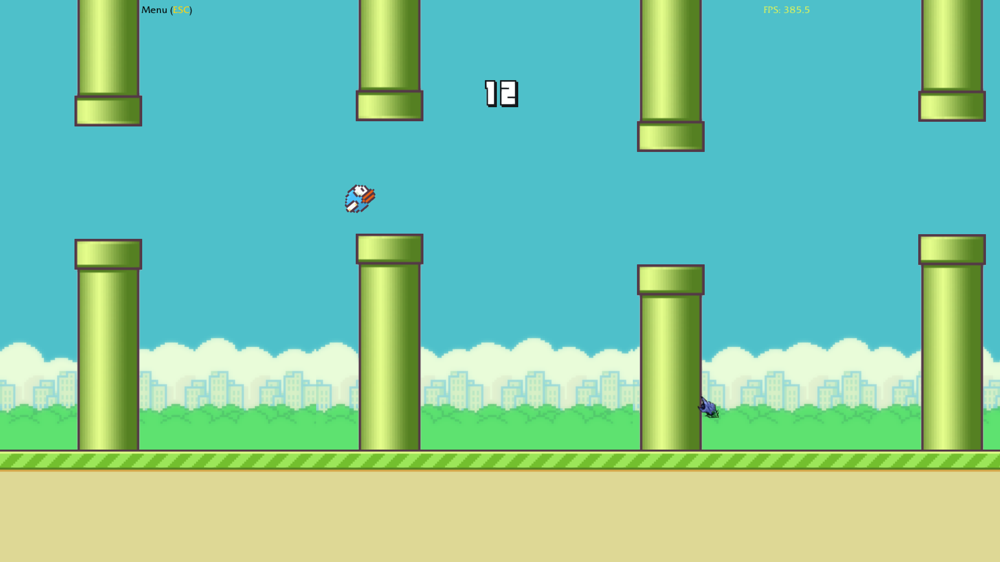
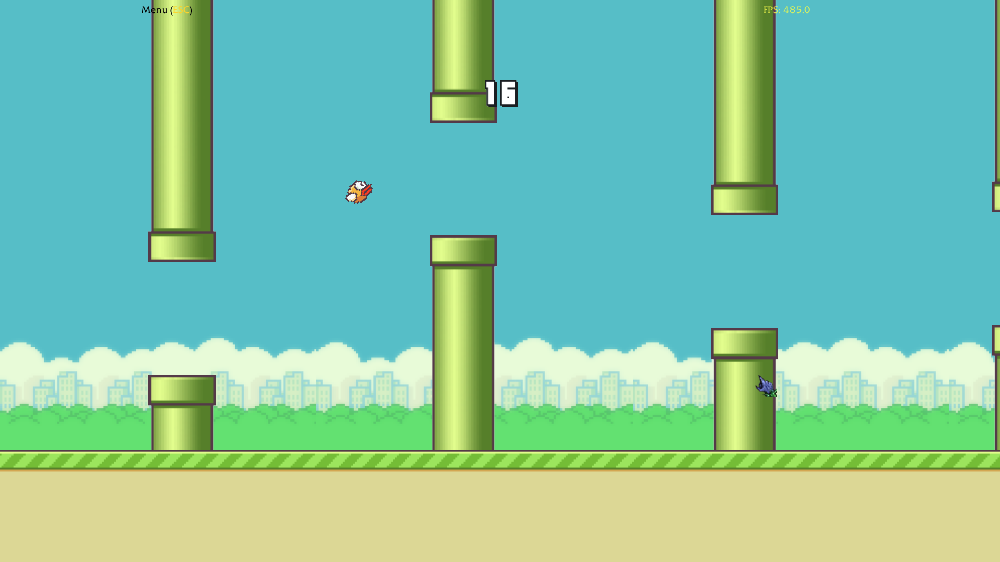
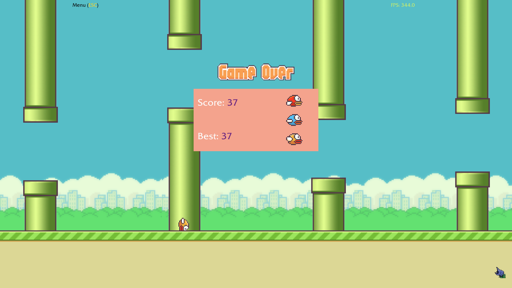

## Flappy Bird — Warcraft III Edition

    
    
    
    

A fully custom Flappy Bird clone built inside Warcraft III using only the native Frame UI API.  
Developed in February 2025, updated in July 2025. Target patch: `Reforged 2.0.3`.

## Features

- Pure UI implementation: all visuals built with frames (no world game objects)
- Angle-based sprite switching using pre-generated MDL model variations
- Adaptive layout: resizes to different screen aspect ratios
- Persistent high score saving using the Preload Exploit technique

## Links

**Latest Version:**
- [📥 XGM](https://xgm.guru/p/wc3/flappybird2d)
- [📥 HIVE](https://www.hiveworkshop.com/threads/flappy-bird.358576/)

**Outdated / Old Version:**
- [📥 Epicwar](https://www.epicwar.com/maps/345054/)
- [▶️ YouTube Preview](https://youtu.be/cKfmRm-XE6g)

## Dependencies

- [cheapack](https://github.com/nazarpunk/cheapack) — Lua tool for building and launching the map
- [Flappy Bird Assets](https://github.com/samuelcust/flappy-bird-assets) — Assets by Samuel Cust
- Magos’ MDX Library (`MdxLib.dll`) — Used in the sprite generation tool

## Legal Notice

Warcraft III and all related assets are © Blizzard Entertainment, Inc.  
This is a fan-made project with no affiliation to or endorsement by Blizzard.  
All third-party assets are credited to their respective authors.
